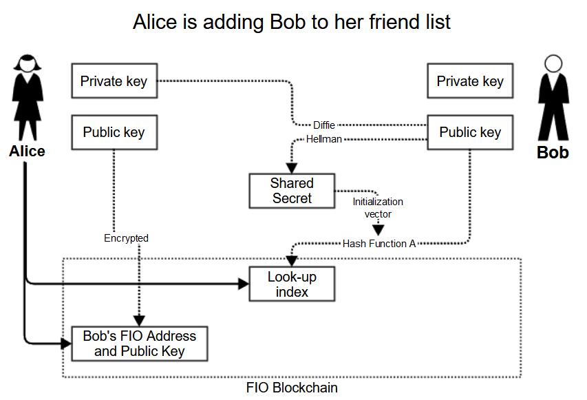

## Abstract

## Motivation
Even though contents of FIO Requests and OBT Records is already encrypted, there are two other areas where privacy of the FIO Protocol can be improved:
* Native Blockchain Public Addresses (NBPAs) mapped to FIO Addresses are stored on-chain unencrypted. This allows blockchain observers to:
  * Associate NBPAs to indetifiable FIO Addresses
  * Associate NBPAs on different blockchains belonging to a single individual/entity through a common FIO Address
* Anytime a FIO Request or OBT Record is stored on chain, the FIO Addresses of both parties are stored unencrypted. This allows blockchain observers to:
  * Associate FIO Addresses transacting with each other, even though the details of those transactions are private

## Specification
### Friend List
The core concept which acomplishes objectives described in *Motivation* is Friend List. The challange with creating a Friend List on open-blockchain is that it cannot be known that FIO Addresses are transacting with each other. To solve this challange one party's public key is encrypted using Diffie-Hellman Key Exchange scheme.
### Adding a friend to a Friend List
The terminology used here is Sender and Receiver, because Friend List is applied to all transactions and depending on transaction type sometimes Sender is Payee and sometimes Payer.
* Receiver wants to allow Sender to send transactions to Receiver (types FIO Address into wallet)
* Receiver's wallet fetches FIO Public Key associated to FIO Address entered
* Receiver's wallet uses Receiver's FIO Private Key and Sender's FIO Public Key to derive a shared secret (Secret) using Diffie-Hellman Key Exchange scheme.
* Receiver's wallet records on the blockchain:
 * Sender's FIO Address and FIO Public Key encrypted symmetrically with Receiver's FIO Private Key. This will be used by Receiver to be able to restore their Friend List from wallet seed phrases without relying on local storage.
 * Sender's FIO Public Key hashed using [Hash Function A](https://github.com/fioprotocol/fiojs/blob/3b3604bb148043dfb7e7c2982f4146a59d43afbe/src/tests/encryption-fio.test.ts#L65) and Secret as initialization vector. This will be used as a look-up index by Sender to check if they are on whitelist.
 
 

## Rationale
## Implementation
## Backwards Compatibility
## Future considerations
